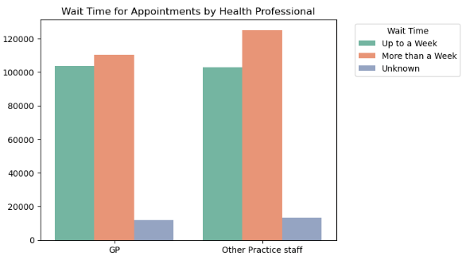
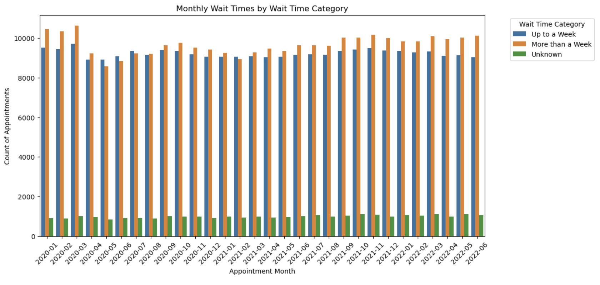
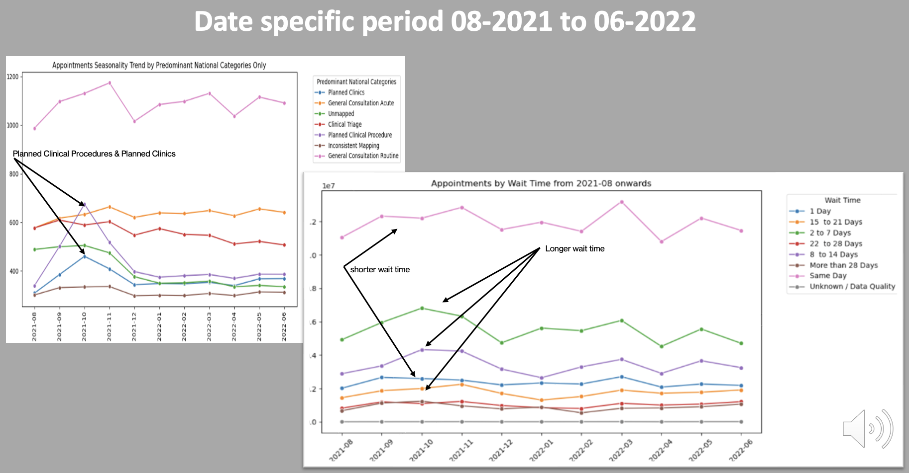
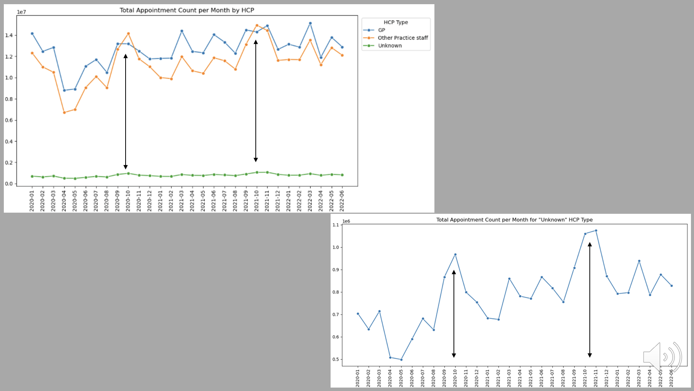
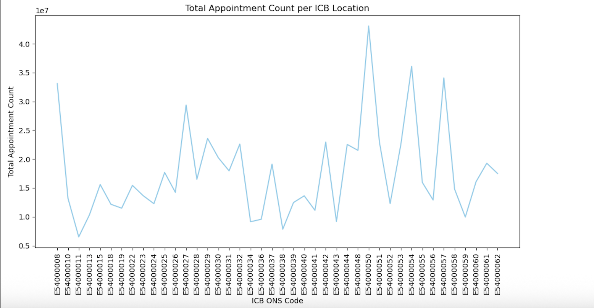

# NHS-Utilisation-Capacity-Analysis

**Tools used**: Excel, Python (Pandas, Numpy, Matplotlib, Seaborn)

📂 [Presentation Slides](Presentation_slides_NHS.pdf)
📂 [Technical Report](Cepure_Jurgita_DA201_Assignment_Report.pdf)
📂 [Code Notebook](Cepure_Jurgita_DA201_Assignment_NHS.ipynb)
📂 [Feedback](Jurgita_Cepure_Assignment_feedback.pdf)

----------------------

## ❓ Business Questions: 

A growing population is placing increased strain on publicly funded infrastructure across the country and to support better planning and budgeting in the future, the NHS wanted to explore appointment data within primary care to determine:
- Has there been adequate staff and capacity in the networks?
- What was the actual utilisation of resources?

---------------------- 

## 🎯 Key Focus Areas:

-	Were there significant differences within appointment status categories?
-	Were there seasonal variations in appointments, and how were they distributed across locations?
-	Who carried out those appointments?
-	What modes of consultations were used?
-	What was the wait time for appointments?
-	What did appointment duration show?
-	At a national level, did service setting, context type and national categories reflect trends the appointment metrics?

----------------------

## 🫚 Data Source, Data Limitation & Unit of Measure
Three datasets of varying structure, quality, and time frame were provided. The Twitter dataset was found to be generic and irrelevant to the scope of the analysis.

Appointments are the unit of measurement.

No data available on current staff numbers.

No data on appointments capacity, other than a daily average of 1.2 million as the maximum capacity guideline.

----------------------

## ⚙️ Analytical Approach 

**Cleaned and pre-processed the data** by handling duplicates, correcting data types, and improving database interactions to ensure completeness and reliability.

Carried out **Exploratory Data Analysis** using Python to find suitable metrics and to uncover key patterns.

**Created Visuals with Python** focused on demonstrating insights & trends.

----------------------

## 📊 Patterns, Trends, and Insights

**GPs and Other Practice staff** handle **similar quantity of appointments** on average

Vast **majority of appointments are Face-to-Face or by phone** and are handled in similar quantities either by GP or Other Practice staff

On average, **46% of appointments are same-day, a characteristic of the UK booking system** where appointments can only be made on the same day.

**If patients book the appointment, they turn up for it at the rate of ~95% across the entire network** with only 4% cancelling and the trend is repeated no matter the season and across all locations

**The real challenge** appears to lie in **the availability of appointments by Other Practice Staff**, and even more so, of specialists’ appointments. GPs and Other Practice Staff handle a similar number of appointments for the  same-day, next-day, and same-week bookings. However, when patients have to wait longer for an appointment, it is more likely they will be waiting for the specialist appointment with Other Practice Staff.

Except for the early months of the Covid pandemic and January 2021 (a lockdown month), **appointments with longer wait times have consistently outpaced those with shorter waits, with their proportion gradually increasing**. This may **indicate an overall shortage of staff, or** a shortage for **specific appointment types**.

**The annually recurring autumn peak**, primarily atributed to Planned Clinical Procedures, reveals several **operational pressure points**:

Same-day and next-day GP appointments dropped, while appointments with 2–21 day wait times increased, **indicating delays in routine care**. Appointments with shorter wait times recovered more quickly than those with longer wait times, which supports **the hypothesis that longer-wait services depend more heavily on ‘Other Practice Staff’**.

A notable rise in appointments handled by Other Practice Staff occurred during the autumn peak, alongside growth in the smaller but steadily increasing ‘Unknown’ HCP category—both suggesting **elevated demand and possible Other Staff strain**. Additionally, there was a spike in ‘Unmapped’ service settings, which, although small in proportion, may **reflect ad hoc operational adjustments or gaps in staffing**.

These patterns point to a temporary redistribution or shortage of Other Practice Staff across the NHS network during the autumn peak. **Combined with a gradually increasing proportion of longer-wait appointments throughout the year, this may signal a growing systemic shortfall in specific appointment types.**

Provided number of 1.2 million appointments per day equals to **70-85% utilization capacity on average across the entire network. 
However, this capacity utilization may vary significantly across different regions or units**:

----------------------

## 💊 Conclusions and Next Steps

- **Data quality remains a** notable **issue** affecting the accuracy of capacity assessments. **Improving data collection through staff incentives and standardizing systems** across the network could be effective solutions.

- Appointment attendance is over 90%. Patients are not misusing the system in this way.

- There are **peak appointment periods adding strain on resources**: autumn, driven by planned clinical procedures, and March and June, observed in general trends

- While there is **evidence of a shortage of staff within the broad category of Other Practice Staff**, more granular **analysis at specific locations is necessary** to identify localized staff shortages and address service needs.

----------------------
